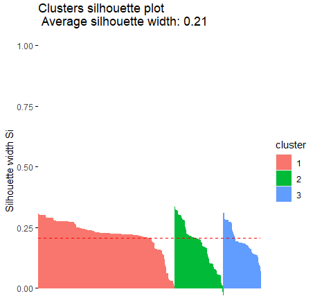

# Hierarchical_cluster_analysis

My objective was to use hierarchical cluster analysis to see if there were notable relationships between cheeses based on their different characteristics. I utilized this [dataset](https://github.com/rfordatascience/tidytuesday/blob/master/data/2024/2024-06-04/readme.md), comprised of 248 chheses based on information on [cheese.com](https://www.cheese.com/). This is an ongoing project. 

### Tools and Libraries Used

* R
* Tidyverse
* cluster
* klaR
* VIM
* ggplot2

## Data Dictionary

| variable        | class     | description                                                                                                                       |
|-----------------|-----------|-----------------------------------------------------------------------------------------------------------------------------------|
| cheese          | character | Name of the cheese.                                                                                                               |
| url             | character | Location of the cheese's description at cheese.com                                                                                |
| milk            | character | The type of milk used for the cheese, when known.                                                                                 |
| country         | character | The country or countries of origin of the cheese.                                                                                 |
| region          | character | The region in which the cheese is produced, either within the country of origin, or as a wider description of multiple countries. |
| family          | character | The family to which the cheese belongs, if any.                                                                                   |
| type            | character | The broad type or types to describe the cheese.                                                                                   |
| fat_content     | character | The fat content of the cheese, as a percent or range of percents.                                                                 |
| calcium_content | character | The calcium content of the cheese, when known. Values include units.                                                              |
| texture         | character | The texture of the cheese.                                                                                                        |
| rind            | character | The type of rind used in producing the cheese.                                                                                    |
| color           | character | The color of the cheese.                                                                                                          |
| flavor          | character | Characteristic(s) of the taste of the cheese.                                                                                     |
| aroma           | character | Characteristic(s) of the smell of the cheese.                                                                                     |
| vegetarian      | logical   | Whether cheese.com considers the cheese to be vegetarian.                                                                         |
| vegan           | logical   | Whether cheese.com considers the cheese to be vegan.                                                                              |
| synonyms        | character | Alternative names of the cheese.                                                                                                  |
| alt_spellings   | character | Alternative spellings of the name of the cheese (likely overlaps with synonyms).                                                  |
| producers       | character | Known producers of the cheese.                                                                                                    |

## Data Cleaning, Exploration, and Visualization

I selected categorical columns from the dataset that I wanted to work with; cheese, milk, country, type, and flavor.

Using K nearest neighbors, I inputed data into cells in the milk column in order to fill in missing values. These values would be based on the other values in the milk column. 

Afterwards, I used K-modes clustering to assign the data to clusters for analysis. 

I used Gower's distance to account for the categorical nature of the variables. This way the clusters would be more meaningful when there are a mix of types of variables. 

Finally I visualized the clusters using a silhouette plot.

 

## Assumptions

Gower's distance compares whether two observations have the same category or not. If two observations belong to the same category for a particular variable, the distance for that variable is 0. If they belong to different categories, the distance is 1. I am assuming that the observations are homogeneous within each cluster. 

## Cluster Results

* Cluster 1 (487 observations) 
* Cluster 2 (272 observations)
* Cluster 3 (428 observations)

## Conclusions

The clusters are somewhat evenly distributed. This could be due to balanced diversity in the data and that Gower's distance treats all variables equally and prevents any single categorical variable from dominating the clustering process. 

